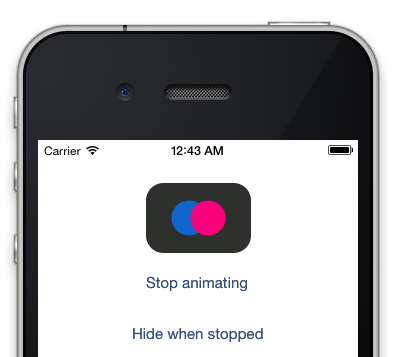

# MDFlickrActivityIndicatorView

Inspired by this [CSS3 version of Flickr Loading Animation](http://codepen.io/beau/pen/aAxDy).

## How to use it?

Download the source and drag the "MDFlickrActivityIndicator" folder into your Xcode project.

Then, either instantiate the MDFlickrActivityIndicator via code, or add a "UIView" object to your Storyboard, and set its class to MDFlickrActivityIndicator.

Then, use as you would a normal UIActivityIndicatorView. Call 
    
    [view startAnimating]
    
to begin animation, and

    [view stopAnimating]
    
to stop animation.

## License

Licensed under GPLv3. 

&copy; 2013 Jānis Kiršteins <janis@janiskirsteins.org>
    

